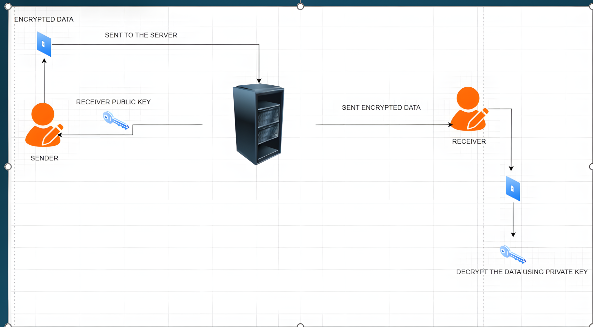
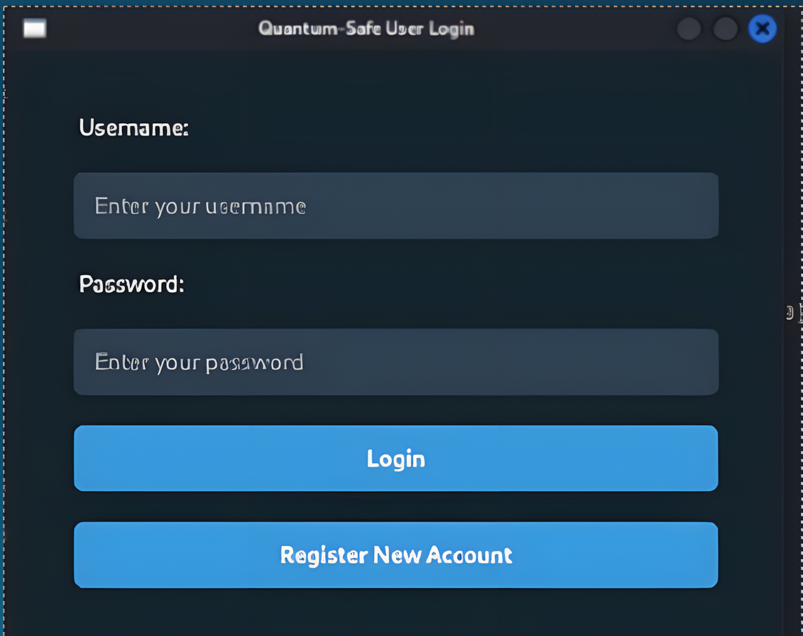
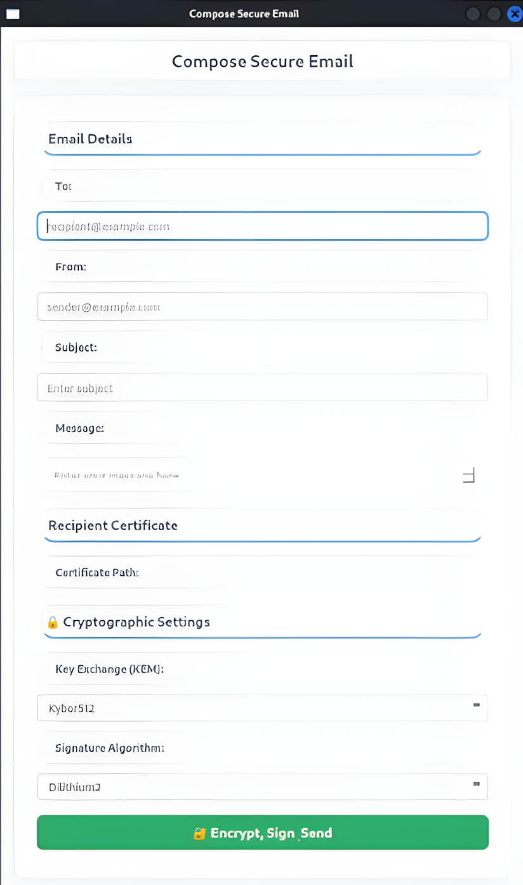
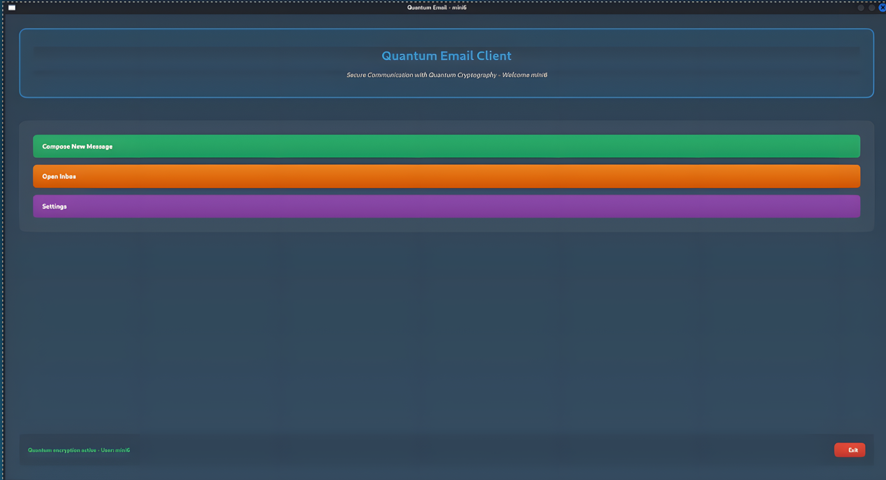
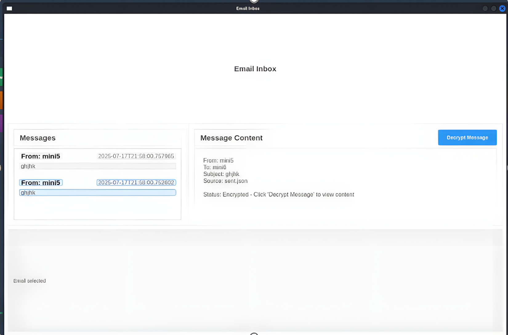

# 🛡️ OpenSSH Quantum-Safe Mail System


<h3 align="center">
  🔐 Post-Quantum Secure Email Communication System
</h3>

<p align="center">
  A secure email system combining <b>OpenSSH</b>, 
  <b>Post-Quantum Cryptography</b>, 
  <b>Hybrid AES + KEM Encryption</b>, 
  <b>Digital Signatures</b>, and a <b>Custom SMTP Server</b>.
</p>

<p align="center">


</p>

# 🚀 Overview

**OpenSSH Quantum-Safe Mail System** is a secure email communication platform designed to explore the integration of **Post-Quantum Cryptography (PQC)** into email communication.

The system combines:

* 🔐 **Post-Quantum Key Encapsulation Mechanisms**
* 🔒 **AES-256 symmetric encryption**
* ✍️ **Post-Quantum digital signatures**
* 🛡️ **OpenSSH secure communication**
* 📡 **Custom SMTP server**
* 🔑 **Automated cryptographic key management**
* 🖥️ **PyQt5 desktop interface**

The main objective is to demonstrate how modern email infrastructure can be enhanced with cryptographic mechanisms designed to remain secure against future quantum-computing threats.

---

# ⚛️ Why Post-Quantum Email Security?

Modern public-key cryptography relies heavily on mathematical problems that are difficult for classical computers.

Large-scale quantum computers could potentially threaten some widely used public-key cryptographic systems.

This project explores a **quantum-resistant communication architecture** using algorithms from the **Open Quantum Safe ecosystem**.

### Traditional Model

```text
Sender
   │
   ▼
Classical Cryptography
   │
   ▼
Email Server
   │
   ▼
Receiver
```

### Quantum-Safe Model

```text
Sender
   │
   ▼
AES-256 Encryption
   │
   ▼
Post-Quantum KEM
   │
   ▼
Digital Signature
   │
   ▼
Secure SMTP / OpenSSH
   │
   ▼
Receiver
   │
   ▼
Post-Quantum Decryption
   │
   ▼
Original Message
```

---

# ✨ Key Features

| Feature                    | Description                                              |
| -------------------------- | -------------------------------------------------------- |
| 🔐 Post-Quantum Encryption | Uses PQC algorithms for secure key establishment         |
| 🔒 Hybrid Encryption       | Combines AES with Post-Quantum KEM                       |
| ✍️ Digital Signatures      | Provides message authentication and integrity            |
| 🛡️ OpenSSH Integration    | Provides secure communication infrastructure             |
| 📡 Custom SMTP Server      | Python-based email transport layer                       |
| 🔑 Key Management          | Automatic generation and selection of cryptographic keys |
| 📬 Secure Inbox            | Messages are decrypted using the recipient's private key |
| 🖥️ PyQt5 GUI              | Complete desktop application interface                   |
| 🔐 End-to-End Protection   | Email content is encrypted before transmission           |

---

# 🔄 How the System Works

The complete communication process can be understood in **six stages**.

### 1. 👤 User Registration

When a user registers:

```text
User Registration
       │
       ▼
Generate PQ Key Pair
       │
       ├── Public Key
       │
       └── Private Key
```

The private key is stored locally while the corresponding public key is made available for secure communication.

---

### 2. ✉️ Email Composition

The sender writes an email using the PyQt5 interface.

```text
Sender
  │
  ▼
Compose Email
  │
  ▼
Select Recipient
  │
  ▼
Select Cryptographic Algorithm
```

---

### 3. 🔒 Hybrid Encryption

Instead of encrypting the complete email directly with a computationally expensive public-key algorithm, the system uses a hybrid approach.

```text
                 Email
                   │
                   ▼
            Generate AES Key
                   │
                   ▼
             AES-256 Encrypt
                   │
                   ▼
          Encrypted Email Data
```

The AES session key is then protected using a Post-Quantum KEM.

```text
AES Session Key
       │
       ▼
Post-Quantum KEM
       │
       ▼
Encapsulated Key
```

---

### 4. ✍️ Digital Signature

The encrypted message can be authenticated using a Post-Quantum digital signature algorithm.

```text
Encrypted Message
       │
       ▼
Hash / Message Data
       │
       ▼
PQ Digital Signature
       │
       ▼
Signed Message
```

This helps provide:

* Message integrity
* Sender authentication
* Protection against message modification

---

### 5. 📡 Secure Transmission

The encrypted package is transferred through the custom SMTP infrastructure and OpenSSH-based communication components.

```text
┌──────────────┐
│    Sender    │
└──────┬───────┘
       │
       │ Encrypted Message
       ▼
┌──────────────┐
│ Custom SMTP  │
│    Server    │
└──────┬───────┘
       │
       │ Secure Transport
       ▼
┌──────────────┐
│   Receiver   │
└──────────────┘
```

---

### 6. 📬 Decryption

The receiver uses their private key to recover the encrypted session key.

```text
Encrypted KEM Data
       │
       ▼
Receiver Private Key
       │
       ▼
Recover AES Session Key
       │
       ▼
AES-256 Decryption
       │
       ▼
Original Email
```

---

# 🏗️ System Architecture

<p align="center">
  
</p>

### Architecture Overview

```text
                         ┌─────────────────────┐
                         │      PyQt5 GUI      │
                         │                     │
                         │ Login / Register    │
                         │ Compose / Inbox     │
                         │ Algorithm Selection │
                         └──────────┬──────────┘
                                    │
                                    ▼
                         ┌─────────────────────┐
                         │   Python Backend    │
                         │                     │
                         │ User Management     │
                         │ Email Processing    │
                         │ Crypto Operations   │
                         └──────────┬──────────┘
                                    │
                    ┌───────────────┼───────────────┐
                    │               │               │
                    ▼               ▼               ▼
              ┌──────────┐   ┌──────────┐   ┌────────────┐
              │ AES-256  │   │  liboqs  │   │Key Manager │
              └──────────┘   └──────────┘   └────────────┘
                    │               │               │
                    └───────────────┼───────────────┘
                                    ▼
                         ┌─────────────────────┐
                         │   Custom SMTP       │
                         │      Server         │
                         └──────────┬──────────┘
                                    │
                                    ▼
                         ┌─────────────────────┐
                         │   Secure Storage    │
                         │                     │
                         │ Emails + Public     │
                         │ Keys                │
                         └─────────────────────┘
```

---

# 🔐 Encryption Architecture

The system follows a **hybrid encryption model**.

```text
                         EMAIL
                           │
                           ▼
                 ┌───────────────────┐
                 │ Generate Random   │
                 │ AES Session Key   │
                 └─────────┬─────────┘
                           │
                           ▼
                 ┌───────────────────┐
                 │    AES-256        │
                 │ Encrypt Message   │
                 └─────────┬─────────┘
                           │
                           ▼
                 ┌───────────────────┐
                 │ Post-Quantum KEM  │
                 │ Protect AES Key   │
                 └─────────┬─────────┘
                           │
                           ▼
                 ┌───────────────────┐
                 │ PQ Digital        │
                 │ Signature         │
                 └─────────┬─────────┘
                           │
                           ▼
                    ENCRYPTED EMAIL
```

### Why Hybrid Encryption?

Symmetric encryption such as AES is efficient for encrypting large amounts of data.

Post-Quantum KEM algorithms are used to securely establish/protect the symmetric session key.

Therefore:

> **AES handles the data. PQ KEM protects the key.**

This provides a practical cryptographic architecture.

---

# 📡 Email Security Flow

```text
┌───────────────┐
│    Register   │
└───────┬───────┘
        ▼
┌───────────────────┐
│ Generate PQ Keys  │
└───────┬───────────┘
        ▼
┌───────────────────┐
│ Store Private Key │
│     Locally       │
└───────┬───────────┘
        ▼
┌───────────────────┐
│ Publish Public    │
│       Key         │
└───────┬───────────┘
        ▼
┌───────────────────┐
│  Compose Email    │
└───────┬───────────┘
        ▼
┌───────────────────┐
│ Generate AES Key  │
└───────┬───────────┘
        ▼
┌───────────────────┐
│ AES-256 Encrypt   │
└───────┬───────────┘
        ▼
┌───────────────────┐
│ PQ KEM Encryption │
└───────┬───────────┘
        ▼
┌───────────────────┐
│ Digital Signature │
└───────┬───────────┘
        ▼
┌───────────────────┐
│   Custom SMTP     │
└───────┬───────────┘
        ▼
┌───────────────────┐
│     Receiver      │
└───────┬───────────┘
        ▼
┌───────────────────┐
│ PQ Decapsulation  │
└───────┬───────────┘
        ▼
┌───────────────────┐
│ AES-256 Decrypt   │
└───────┬───────────┘
        ▼
┌───────────────────┐
│   Verify Message  │
└───────┬───────────┘
        ▼
       📬
   Read Email
```

---

# 🧬 Cryptographic Algorithms

## 🔑 Key Encapsulation Mechanisms

The project supports multiple Post-Quantum KEM algorithms through the Open Quantum Safe ecosystem.

| Algorithm        | Type          |
| ---------------- | ------------- |
| Kyber512         | Lattice-based |
| Kyber768         | Lattice-based |
| Kyber1024        | Lattice-based |
| BIKE-L1          | Code-based    |
| BIKE-L3          | Code-based    |
| FrodoKEM         | Lattice-based |
| NTRU             | Lattice-based |
| NTRU-HRSS        | Lattice-based |
| SABER            | Lattice-based |
| LightSaber       | Lattice-based |
| FireSaber        | Lattice-based |
| Classic McEliece | Code-based    |

---

## ✍️ Digital Signatures

| Algorithm      | Type          |
| -------------- | ------------- |
| Dilithium2     | Lattice-based |
| Dilithium3     | Lattice-based |
| Dilithium5     | Lattice-based |
| Falcon-512     | Lattice-based |
| Falcon-1024    | Lattice-based |
| SPHINCS+-SHA2  | Hash-based    |
| SPHINCS+-SHAKE | Hash-based    |

> **Note:** Some algorithms listed in the original project may be legacy/deprecated in current PQC libraries. The README should describe exactly which algorithms are actually available in the version of `liboqs` used by the project.

---

# 🔑 Key Management

## Client-Side Keys

```text
username_keys/
│
└── {algorithm}/
    ├── {username}_{algorithm}_public.key
    └── {username}_{algorithm}_private.key
```

### Public Key

Used by other users to establish encrypted communication.

### Private Key

Used locally by the owner to recover protected session keys and perform cryptographic operations.

> 🔒 Private keys should never be exposed publicly or committed to Git.

---

## Server-Side Public Keys

```text
server/
│
└── server_keys/
    └── public_key/
        └── {username}/
            └── {algorithm}/
                └── {username}_{algorithm}_public.key
```

The server stores public cryptographic information required for communication.

---

# 🖥️ Application Screenshots

> 📸 Screenshots will be added here from the actual application.

## 🔐 Login

<p align="center">
  
</p>

---

## 👤 Registration

<p align="center">
  
</p>

---

## ✉️ Compose Email

<p align="center">
  
</p>

---

## 🔑 Algorithm Selection

<p align="center">
  
</p>

---

## 📬 Secure Inbox

<p align="center">
  
</p>

---

# 📂 Project Structure

```text
OPENSSH-MAIL-SYSTEM/
│
├── 📂 gui/
│   ├── algorithm_selector.py
│   ├── email_composer.py
│   ├── inbox_window.py
│   ├── main_window.py
│   └── __init__.py
│
├── 📂 python_backend/
│   ├── aes_crypto.py
│   ├── compose_window.py
│   ├── decrypt_utils.py
│   ├── email_crypto.py
│   ├── inbox_window.py
│   ├── login_window.py
│   ├── register_window.py
│   ├── sshd_launcher.py
│   ├── user_manager.py
│   └── __init__.py
│
├── 📂 mainserver/
│   ├── custom_smtp_server.py
│   ├── send_via_smtp.py
│   ├── smtp_handler.py
│   └── __init__.py
│
├── 📂 server/
│   ├── emails/
│   └── server_keys/
│       └── public_key/
│
├── 📂 assets/
│   ├── logo.png
│   ├── system-architecture.png
│   ├── login.png
│   ├── register.png
│   ├── compose.png
│   ├── algorithm-selection.png
│   └── inbox.png
│
├── main.py
├── requirements.txt
├── LICENSE
└── README.md
```

---

# 🧰 Technology Stack

| Layer                | Technology                  |
| -------------------- | --------------------------- |
| Programming Language | Python 3                    |
| GUI                  | PyQt5                       |
| PQC                  | liboqs / liboqs-python      |
| Symmetric Encryption | AES-256                     |
| KEM                  | Kyber, NTRU, SABER, etc.    |
| Digital Signatures   | Dilithium, Falcon, SPHINCS+ |
| Secure Transport     | OpenSSH                     |
| Mail Transport       | Custom SMTP                 |
| Networking           | Sockets                     |
| Concurrency          | Python Threads              |
| System Integration   | Subprocess                  |

---

# ⚙️ Installation

## 1. Clone the Repository

```bash
git clone https://github.com/Dsaini2002/OPENSSH-MAIL-SYSTEM.git

cd OPENSSH-MAIL-SYSTEM
```

## 2. Install Python Dependencies

```bash
pip install -r requirements.txt
```

## 3. Build liboqs

```bash
git clone --recursive https://github.com/open-quantum-safe/liboqs

cd liboqs

cmake -DCMAKE_INSTALL_PREFIX=../liboqs-install .

make
make install
```

## 4. Install liboqs-python

```bash
git clone https://github.com/open-quantum-safe/liboqs-python

cd liboqs-python

python3 setup.py build
python3 setup.py install
```

---

# ▶️ Running the Application

From the project root:

```bash
python main.py
```

Make sure:

* Python dependencies are installed.
* `liboqs` is correctly built.
* Required cryptographic keys can be generated.
* OpenSSH components are configured correctly.
* Required ports are available.

---

# 🛡️ Security Model

The system is designed around multiple security layers.

```text
                APPLICATION
                     │
                     ▼
             ┌───────────────┐
             │  AES-256      │
             │  Encryption   │
             └───────┬───────┘
                     │
                     ▼
             ┌───────────────┐
             │ Post-Quantum  │
             │     KEM       │
             └───────┬───────┘
                     │
                     ▼
             ┌───────────────┐
             │ PQ Digital    │
             │  Signature    │
             └───────┬───────┘
                     │
                     ▼
             ┌───────────────┐
             │ Custom SMTP   │
             └───────┬───────┘
                     │
                     ▼
             ┌───────────────┐
             │   OpenSSH     │
             │   Transport   │
             └───────────────┘
```

### Security Objectives

* 🔒 **Confidentiality** — protect email contents.
* 🛡️ **Integrity** — detect unauthorized modifications.
* ✍️ **Authentication** — verify cryptographic message origin.
* 🔑 **Secure Key Establishment** — use PQ KEM mechanisms.
* ⚛️ **Quantum Resistance** — explore cryptographic protection against future quantum threats.

---

## 🔍 Security Research & Bug Hunting

**We actively invite security researchers, cryptographers, and developers to audit and improve this project!**

Since post-quantum cryptography integration is a rapidly evolving field, community review is crucial. We encourage you to:

- 🐛 **Find Bugs:** Identify UI glitches, runtime exceptions, memory leaks, or dependency conflicts.
- 🛡️ **Discover Vulnerabilities:** Test our implementation of `liboqs`, key handling, session key exchange, or payload parsing for side-channel issues, implementation flaws, or weak points.
- ⚡ **Optimize Code:** Improve performance, refine error handling, and clean up key rotation routines.
- 🛠️ **Submit Fixes:** Open a Pull Request with your patch—all constructive contributions will be reviewed and credited!

If you discover a critical security vulnerability, please submit it via [GitHub Security Advisories](https://github.com/Dsaini2002/OPENSSH-MAIL-SYSTEM/security/advisories) or open an issue marked `[SECURITY]`.

# ⚠️ Security Considerations

This project is intended as a **research, educational, and experimental implementation** of Post-Quantum secure email communication.

It should not be considered a production-grade email security system without:

* Independent security auditing
* Formal cryptographic review
* Secure key storage
* Authentication hardening
* Network security testing
* Robust certificate/key validation
* Secure deployment configuration
* Updated standardized PQC algorithms

---

# 🚧 Limitations

Current limitations may include:

* Local/custom SMTP infrastructure
* Experimental PQC integration
* Local key storage
* Limited production deployment
* No independent security audit
* Dependency on specific `liboqs` versions

---

# 🔮 Future Improvements

* [ ] ML-KEM standardized deployment
* [ ] ML-DSA standardized deployment
* [ ] Automatic key rotation
* [ ] Hardware-backed private-key storage
* [ ] Encrypted database
* [ ] Secure file attachments
* [ ] Multi-user distributed deployment
* [ ] Docker support
* [ ] Cloud deployment
* [ ] Security audit
* [ ] Automated cryptographic testing
* [ ] Performance benchmarking
* [ ] Threat-model documentation
* [ ] Secure production SMTP integration

---

# 📊 Performance Benchmarking

A future version of the project can benchmark:

| Algorithm  | Key Generation | Encapsulation | Decapsulation | Key Size |
| ---------- | -------------: | ------------: | ------------: | -------: |
| Kyber512   |            TBD |           TBD |           TBD |      TBD |
| Kyber768   |            TBD |           TBD |           TBD |      TBD |
| Kyber1024  |            TBD |           TBD |           TBD |      TBD |
| Dilithium2 |            TBD |           TBD |           TBD |      TBD |
| Falcon-512 |            TBD |           TBD |           TBD |      TBD |

> Benchmark values should be measured on the actual target machine rather than estimated.

---

# 🎯 Project Goals

The project demonstrates how Post-Quantum Cryptography can be incorporated into a complete communication application rather than being treated only as an isolated cryptographic experiment.

### Core Goals

```text
       Post-Quantum Cryptography
                  +
             Hybrid Crypto
                  +
              OpenSSH
                  +
           Custom SMTP
                  +
              PyQt5 GUI
                  ↓
      Quantum-Safe Email Prototype
```

---


# 📜 License

This project is licensed under the **MIT License**.

See [`LICENSE`](LICENSE) for more information.

---

# ⭐ Support the Project

If you find this project useful or interesting:

⭐ **Star the repository**

🍴 **Fork the project**

🐛 **Report issues**

💡 **Suggest improvements**

🤝 **Contribute**

---

<p align="center">

### 🛡️ Building Secure Communication for the Post-Quantum Era

**OpenSSH Quantum-Safe Mail System**

</p>
